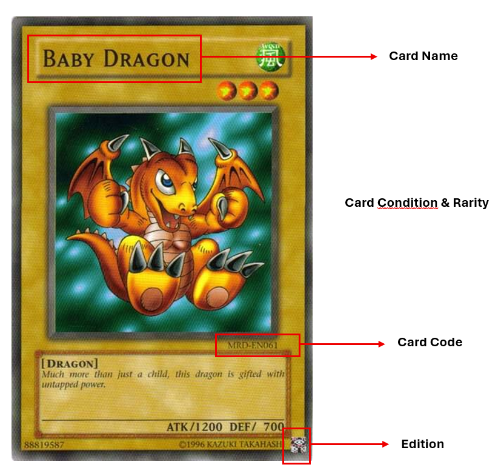

# Yu-Gi-Oh Singles Price Tracker

A compact Python project that turns a human-readable Excel inventory into a priced Yu-Gi-Oh singles portfolio.

**You do not need to know Cardmarket product IDs.** Add a card to the `Triple_Loose` sheet using its normal card information; the program identifies the printing, resolves the Cardmarket product, caches that decision, downloads the daily Cardmarket price guide, and shows the result in a Tkinter GUI.

## What it does

```text
Excel inventory
      │
      ▼
YGOPRODeck printing identification
(name + set code + rarity)
      │
      ▼
Cardmarket expansion/product matching
(public product catalogs)
      │
      ▼
SQLite match cache + daily price history
      │
      ▼
GUI: portfolio, cards, issues, history
```

The matching system is intentionally conservative. It will **not silently guess** when several products are plausible.

## GUI features

The desktop GUI is designed both for browsing the collection and for making diagnostics easy to share:

- **All cards** shows the TRICARD ID, current unit price, total row value and pricing status.
- Filter cards by name, set code, rarity, location or match status.
- Sort the visible cards by **TRICARD code**, **unit price**, or **card name**, in ascending or descending order.
- **Double-click** any row in **All cards** to open its **Card history** window. A single click only selects the row. The history shows every daily Cardmarket snapshot stored for that card's resolved product, including the selected benchmark, trend and moving-average fields.
- **Copy content** buttons on the tabular views and Card history copy a tab-separated text representation to the clipboard, which is convenient for pasting into an issue, message or analysis. Plots remain visual-only.
- **Pricing & matching issues** explains every row that is not currently priced.
- **Portfolio history** plots the stored total collection value by day.

Card history starts with the first price snapshot stored by this project and grows as daily updates are run. Matching is cached independently, so viewing history does not trigger any network requests.

## What happens when you run each file

The project separates **updating data** from **viewing data**:

| File | Purpose | Uses internet? | Writes database? |
|---|---|---:|---:|
| `run_daily.py` | Runs `update.py` and writes a timestamped log | indirectly | indirectly |
| `update.py` | Command-line entry point for one price refresh | yes | yes |
| `core.py` | Reads Excel, downloads/parses prices, stores/query snapshots | yes during update | yes |
| `matcher.py` | Resolves Cardmarket Product IDs and caches/manual overrides | only when matching is needed | yes |
| `app.py` | Desktop GUI for cards, issues, overrides and history | **no** | only when saving/removing a manual override |
| `launch_gui.pyw` | Convenience launcher for `app.py` on Windows | no | no |

### Normal daily workflow

```text
run_daily.py
    │
    ├─ creates logs/update_<timestamp>.log
    │
    └─ starts update.py
           │
           └─ core.update()
                │
                ├─ read Triple_Loose from Excel
                ├─ matcher.py: manual override → cache → automatic matching
                ├─ download the current Cardmarket Yu-Gi-Oh price guide
                ├─ keep prices only for matched Product IDs
                ├─ store that dated price snapshot in SQLite
                └─ store the dated total portfolio value

app.py / launch_gui.pyw
    └─ read the SQLite results and display them (no price download)
```

**Does it download new prices every day?** It downloads the current Cardmarket price guide **every time `update.py` or `run_daily.py` is executed**. The script itself does not wake up automatically based on the calendar. To make it truly daily, schedule `run_daily.py` once per day with Windows Task Scheduler.

Running it twice on the same Cardmarket snapshot/date does not create two history points: the SQLite primary key updates the existing `(Product ID, date)` record, and the portfolio table similarly keeps one row per date.

The expensive matching step is separate from pricing. On later runs, unchanged cards normally reuse their saved match, so the updater can skip YGOPRODeck/product-resolution work and focus on the new Cardmarket price guide.

**Refresh view** inside the GUI only rereads SQLite. It does not contact Cardmarket or YGOPRODeck.

## Project structure

```text
.
├── app.py                     # Tkinter GUI
├── core.py                    # Excel, SQLite and daily price-guide logic
├── matcher.py                 # automatic card/printing matching
├── update.py                  # manual update command
├── run_daily.py               # logged update for Task Scheduler / cron
├── launch_gui.pyw             # double-click GUI launcher on Windows
├── requirements.txt             # only openpyxl
├── CODE_GUIDE.md                # source-code reading map
├── data/
│   └── inventory.example.xlsx # public Triple_Loose inventory
└── logs/                      # generated logs; log files are ignored by git
```

Generated SQLite files and downloaded API/catalog caches are ignored by Git.


## Dependency philosophy

The project intentionally keeps installation requirements small. It has **one third-party Python dependency**:

- `openpyxl` — reads the `.xlsx` inventory workbook.

Everything else uses Python's standard library: `os`/`os.path` for files and folders, `sqlite3` for the database, `urllib` for HTTPS downloads, `json` for API/catalog data, `tkinter` for the desktop GUI, and `subprocess` for the logged daily runner.

There is deliberately no `pandas`, `requests`, `SQLAlchemy`, `numpy`, or `matplotlib`. The collection is small enough that those packages are unnecessary here.

### File paths use `os`, not `pathlib`

The code uses normal string paths built with `os.path`:

```text
project folder -> os.path.dirname(os.path.abspath(__file__))
data folder    -> os.path.join(ROOT, "data")
file exists?   -> os.path.exists(...)
make folder    -> os.makedirs(..., exist_ok=True)
```

This is a style choice for readability. It does not change the number of dependencies because both `os` and `pathlib` are part of Python itself.

## Public data sources

The project uses public data rather than private credentials:

- YGOPRODeck API: `https://ygoprodeck.com/api-guide/`
- Cardmarket product catalog: `https://www.cardmarket.com/en/Magic/Data/Product-List`
- Cardmarket price guide: `https://www.cardmarket.com/en/Magic/Data/Price-Guide`

Cardmarket's downloadable price guide is normally refreshed daily; product catalogs are refreshed when Cardmarket adds releases. YGOPRODeck asks API users to cache downloaded data and documents a request rate limit, so this project caches set data and throttles its requests.

## Setup

```powershell
python -m venv .venv
.\.venv\Scripts\Activate.ps1
pip install -r requirements.txt
python update.py
python app.py
```

The first update does more work because the cards have not been matched yet. Later daily updates reuse the SQLite match cache and usually only fetch the new Cardmarket price guide.

## Inventory format

The workbook must contain a sheet named `Triple_Loose`.

Required columns:

- `Card ID` — unique stable ID for the inventory row
- `English Name`
- `Card Code` — for example `SDCS-DE044`
- `Rarity`
- `Quantity`

Useful optional metadata already present in the example workbook:

- `Printed Name`
- `Language`
- `Edition`
- `Condition`
- `Location`
- `Notes`

There is deliberately **no `Cardmarket Product ID` column**. Marketplace IDs are an implementation detail and are stored in SQLite after automatic matching.


## Card format: what information is read from the physical card

The inventory is designed around information that can be read directly from the card or assessed from the physical copy.

<p align="center">
  
</p>

The annotated example highlights the most useful information:

- **Card Name** — used together with the set/card code to identify the correct printing.
- **Card Code / Set Code** — one of the most important identifiers, for example `MRD-EN061` or `SDCS-DE044`.
- **Edition** — for example `1st Edition` or `Unlimited`.
- **Rarity / Card Finish** — used to distinguish variants when the same card exists in more than one rarity.
- **Condition** — assessed from the physical card as a whole and stored in the inventory as metadata.

The program also stores **Language** and **Quantity** in the Excel inventory. Language helps describe the physical card, while Quantity determines how many copies contribute to the portfolio total.

### Current valuation assumptions

The tracker is intended to provide a consistent Cardmarket reference valuation rather than an exact resale value.

At the moment, the project makes the following simplifying assumptions:

- Cards are treated as **raw, ungraded cards**.
- The stored `Condition` is currently **metadata only**. The program does not apply a separate discount or premium for NM, EX, LP, etc.
- In practice, the displayed benchmark should therefore be interpreted approximately as an **NM/reference-condition market value**.
- The program does not currently apply a separate language-specific price adjustment.
- `Edition` is stored and included in the card's matching fingerprint, but the automatic matcher primarily relies on **card name + card code + rarity**.
- Multiple copies are valued linearly:

```text
row value = unit benchmark price × quantity
```

- Shipping costs, marketplace fees, grading premiums and bulk-sale discounts are not included.
- If the matcher is not confident enough to identify a product, the card remains unpriced rather than being guessed.

These assumptions keep the valuation transparent and reproducible. Condition- or language-specific pricing can be added later without changing the basic inventory format.

## How matching works

For each new or changed row, `matcher.py`:

1. Normalizes common European set codes to the English code used by YGOPRODeck (`SDAZ-DE001` → `SDAZ-EN001`).
2. Verifies the card name, set code and rarity against YGOPRODeck.
3. Builds evidence for the corresponding Cardmarket expansion using card-name overlap between the YGOPRODeck set and Cardmarket's singles catalog.
4. Uses Cardmarket non-single/sealed-product names as extra evidence, which is useful when TCG and OCG releases contain nearly the same cards.
5. Matches the card name inside the resolved Cardmarket expansion.
6. Uses rarity only when multiple Cardmarket variants need disambiguation.
7. Caches the result. Unchanged rows are not rematched during normal daily updates.

If the evidence is not strong enough, the card remains unpriced instead of being assigned a guessed product.

## Why a card is not priced

The GUI has a **Pricing & matching issues** tab. Each unpriced row includes a status and a human-readable reason.

Typical cases include:

- `UNRESOLVED` — YGOPRODeck did not recognize the name/set-code combination, expansion evidence was too weak, or no matching product existed in the resolved expansion.
- `AMBIGUOUS` — multiple printings/products were plausible and rarity did not select one uniquely.
- `ERROR` — a required public source could not be downloaded or parsed during matching.
- `NO PRICE` — the card was matched to a Cardmarket product, but the latest price guide contained no usable benchmark value for it.

This makes gaps auditable: you can see **which card failed and why** instead of just seeing a missing number.


## Manual Cardmarket ID overrides

Automatic matching is intentionally conservative. For an `AMBIGUOUS` or `UNRESOLVED` row, open **Manual Cardmarket ID Entries**, select the TRICARD row, enter the correct Cardmarket Product ID, and save it.

The override is stored in SQLite and has highest priority on later updates, including `--rematch`. Saving the ID changes the match status immediately, but run `run_daily.py` (or `update.py`) once afterwards so that Product ID receives a price from the current Cardmarket guide. Removing the override returns the row to automatic matching on the next update.

## Re-run matching

Matching is cached. If you correct card metadata or want to retry unresolved rows after source data changes:

```powershell
python update.py --rematch
```

Do not use `--rematch` for normal daily updates.

## Daily price update + logs

Run:

```powershell
python run_daily.py
```

It executes `update.py`, writes a timestamped file under `logs/`, returns the updater's exit code, and keeps the newest 60 logs.

For Windows Task Scheduler, point the task to your virtual environment's Python executable and pass the full path to `run_daily.py`.

## Price metric

The displayed unit value prefers Cardmarket `trend`. If it is unavailable or zero, the fallback order is:

```text
avg7 → avg30 → avg1 → avg → low
```

The portfolio value is `Quantity × selected benchmark` summed over priced inventory rows.

## Optional private inventory

The repository ships with the public `data/inventory.example.xlsx`.

If you ever want a separate private workbook, create:

```text
data/inventory.xlsx
```

The code automatically prefers it and `.gitignore` prevents it from being committed.

## GitHub note

Initialize this folder as a **fresh Git repository**. Do not copy an old `.git` directory from a collection repository that previously contained private files; deleted files can remain in Git history.
